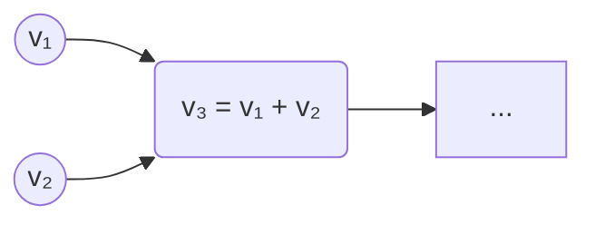
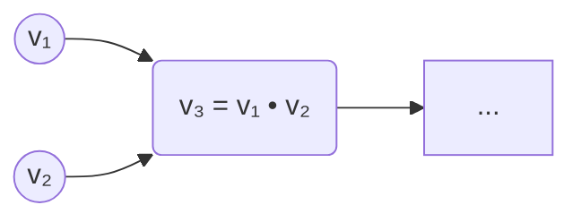

# C_autograd

# 1 Overview

C_autograd is an automatic differentiation program that allows
to apply backpropagation to train ML models. The ML model must be
constructed of tensors, either data tensors or weight tensors. The
gradient descent will be performed only on the weight tensors.

Models are built from tensors that represent either input data or
trainable parameters. During backpropagation, gradients are computed
for all tensors that require them.

---

---

# 2 Tensor Operations and Gradients

The engine supports numerous tensor operations, each resulting in a child
tensor that remembers its parents.

The engine supports a variety of tensor operations. Each operation produces
a new tensor that stores references to its parents. Suppose that the derivative
of the loss function with respect to the child tensor is known. By knowing which
operations was performed on parents, the gradient of the loss with respect to the
parent tensors can be computed.

### Tensor Summation

$$\begin{bmatrix} v_{11}^{(3)} & v_{12}^{(3)} & \dots & v_{1m}^{(3)} \\ v_{21}^{(3)} & v_{22}^{(3)} & \dots & v_{2m}^{(3)} \\ \vdots & \vdots & \ddots & \vdots \\ v_{n1}^{(3)} & v_{n2}^{(3)} & \dots & v_{nm}^{(3)} \end{bmatrix} = \begin{bmatrix} v_{11}^{(1)} & v_{12}^{(1)} & \dots & v_{1m}^{(1)} \\ v_{21}^{(1)} & v_{22}^{(1)} & \dots & v_{1m}^{(1)} \\ \vdots & \vdots & \ddots & \vdots \\ v_{n1}^{(1)} & v_{n2}^{(1)} & \dots & v_{nm}^{(1)} \end{bmatrix} + \begin{bmatrix} v_{11}^{(2)} & v_{12}^{(2)} & \dots & v_{1m}^{(2)} \\ v_{21}^{(2)} & v_{22}^{(2)} & \dots & v_{2m}^{(2)} \\ \vdots & \vdots & \ddots & \vdots \\ v_{n1}^{(2)} & v_{n2}^{(2)} & \dots & v_{nm}^{(2)} \end{bmatrix}$$

* Given: $\frac{\partial L}{\partial v_3}$
* Compute: $\frac{\partial L}{\partial v_1}$ and $\frac{\partial L}{\partial v_2}$

$$\frac{\partial L}{\partial v_{i, j}^{(1)}} = \sum_{k=1}^n \sum_{\ell=1}^m \frac{\partial L}{\partial v_{k, \ell}^{(3)}} \cdot  \frac{\partial v_{k, \ell}^{(3)}}{\partial v_{i, j}^{(1)}} = \frac{\partial L}{\partial v_{i, j}^{(3)}} \cdot \frac{\partial v_{i, j}^{(3)}}{\partial v_{i, j}^{(1)}} = \frac{\partial L}{\partial v_{i, j}^{(3)}}$$
$$\frac{\partial L}{\partial v_{i, j}^{(2)}} = \sum_{k=1}^n \sum_{\ell=1}^m \frac{\partial L}{\partial v_{k, \ell}^{(3)}} \cdot \frac{\partial v_{k, \ell}^{(3)}}{\partial v_{i, j}^{(2)}} = \frac{\partial L}{\partial v_{i, j}^{(3)}} \cdot \frac{\partial v_{i, j}^{(3)}}{\partial v_{i, j}^{(2)}} = \frac{\partial L}{\partial v_{i, j}^{(3)}}$$

Therefore, $$\frac{\partial L}{\partial v_{1}} = \frac{\partial L}{\partial v_{3}}$$
$$\frac{\partial L}{\partial v_{2}} = \frac{\partial L}{\partial v_{3}}$$

---

### Tensor Multiplication

$$
\begin{pmatrix}
v_{11}^{(1)} & \dots & v_{1m}^{(1)} \\
\vdots & \ddots & \vdots \\
v_{n1}^{(1)} & \dots & v_{nm}^{(1)}
\end{pmatrix}_{n \times m}
\cdot
\begin{pmatrix}
v_{11}^{(2)} & \dots & v_{1k}^{(2)} \\
\vdots & \ddots & \vdots \\
v_{m1}^{(2)} & \dots & v_{mk}^{(2)}
\end{pmatrix}_{m \times k}
=
\begin{pmatrix}
v_{11}^{(1)} v_{11}^{(2)} + \dots + v_{1m}^{(1)} v_{m1}^{(2)} & \dots & v_{11}^{(1)} v_{1k}^{(2)} + \dots + v_{1m}^{(1)} v_{mk}^{(2)} \\
\vdots & \ddots & \vdots \\
v_{n1}^{(1)} v_{11}^{(2)} + \dots + v_{nm}^{(1)} v_{m1}^{(2)} & \dots & v_{n1}^{(1)} v_{1k}^{(2)} + \dots + v_{nm}^{(1)} v_{mk}^{(2)}
\end{pmatrix}_{n \times k}$$

* Given: $\frac{\partial L}{\partial v_3}$
* Compute: $\frac{\partial L}{\partial v_1}$ and $\frac{\partial L}{\partial v_2}$

$$\frac{\partial L}{\partial v_{i,j}^{(1)}} = \sum_{h=1}^k \frac{\partial L}{\partial v_{i,h}^{(3)}} \cdot \frac{\partial v_{i,h}^{(3)}}{\partial v_{i,j}^{(1)}} = \sum_{h=1}^k \frac{\partial L}{\partial v_{i,h}^{(3)}} \cdot v_{j,h}^{(2)}$$
$$= \text{i-th row of } \frac{\partial L}{\partial v_3} \cdot \text{the j-th row of } v_2$$

Similar results are achieved for $\frac{\partial L}{\partial v_{i, j}^{(2)}}$. Thus, 

$$\frac{\partial L}{\partial v_1} = \frac{\partial L}{\partial v_3} v_2^T$$
$$\frac{\partial L}{\partial v_2} = v_1^T \frac{\partial L}{\partial v_3}$$

---

### Softmax

Input vector elements $v_1, \dots, v_n$ transformed via Softmax to output activations $S_1, \dots, S_n$:$$S_i = \frac{e^{v_i}}{\sum_j e^{v_j}}$$

* **Case 1: Column Vector Notation**

$$
\begin{bmatrix}
v_1\\
\vdots\\
v_n
\end{bmatrix}
\longrightarrow
\begin{bmatrix}
S_1\\
\vdots\\
S_n
\end{bmatrix}
\longrightarrow
a=\mathbb{1}_a
\begin{bmatrix}
S_1\\
\vdots\\
S_n
\end{bmatrix},
\qquad
\mathbb{1}_a=
\begin{bmatrix}
0&\cdots&1_i&\cdots&0
\end{bmatrix}
$$

$$\frac{\partial L}{\partial a} \longrightarrow \frac{\partial L}{\partial S} = \frac{\partial L}{\partial a} \cdot \frac{\partial a}{\partial S} = \frac{\partial L}{\partial a} \cdot \begin{bmatrix} 0 \\ \vdots \\ 1_i \\ \vdots \\ 0 \end{bmatrix}$$
$$\frac{\partial L}{\partial v} = \begin{bmatrix} \frac{\partial L}{\partial v_1} \\ \vdots \\ \frac{\partial L}{\partial v_n} \end{bmatrix} = \begin{bmatrix} \frac{\partial L}{\partial a} \frac{\partial a}{\partial S_1} \frac{\partial S_1}{\partial v_1} \\ \vdots \\ \frac{\partial L}{\partial a} \frac{\partial a}{\partial S_n} \frac{\partial S_n}{\partial v_n} \end{bmatrix}^T$$
$$= \left( \frac{\partial L}{\partial S} \right)^T \cdot \frac{\partial S}{\partial v} = \frac{\partial L}{\partial a} \begin{bmatrix} 0 \\ \vdots \\ 1_i \\ \vdots \\ 0 \end{bmatrix}^T_{\substack{1 \times n \\ (\mathbb{1}_a)}} \begin{bmatrix} S_1(1 - S_1) & -S_1 S_2 & \dots & -S_1 S_n \\ -S_2 S_1 & S_2(1 - S_2) & \dots & -S_2 S_n \\ \vdots & \vdots & \ddots & \vdots \\ -S_n S_1 & -S_n S_2 & \dots & S_n(1 - S_n) \end{bmatrix}_{n \times n}^T$$
$$= \frac{\partial L}{\partial a} \begin{bmatrix} -S_i S_1 \\ \vdots \\ S_i(1 - S_i) \\ \vdots \\ -S_i S_n \end{bmatrix}$$

* **Case 2: Row Vector Notation**

$$(v_1 \dots v_n)_{1 \times n} \longrightarrow (S_1 \dots S_n)_{1 \times n} \longrightarrow a = (S_1 \dots S_n)_{1 \times n} \cdot {\mathbf{1}_a}_{n \times 1}^T$$

$$\frac{\partial L}{\partial a} \longrightarrow \frac{\partial L}{\partial S} = \frac{\partial L}{\partial a} \cdot \frac{\partial a}{\partial S} \longrightarrow (0 \dots 1 \dots 0)_{1 \times n}$$
$$\frac{\partial L}{\partial V} = \left( \frac{\partial L}{\partial v_1} \dots \frac{\partial L}{\partial v_n} \right) = \left( \frac{\partial L}{\partial a} \frac{\partial a}{\partial S_1} \frac{\partial S_1}{\partial v_1} \dots \frac{\partial L}{\partial a} \frac{\partial a}{\partial S_n} \frac{\partial S_n}{\partial v_n} \right)$$
$$= \frac{\partial L}{\partial S} \cdot \frac{\partial S}{\partial V} = \frac{\partial L}{\partial a} \cdot \underbrace{(0 \dots 1 \dots 0)}_{1 \times n} \cdot \left[ \frac{\partial S}{\partial V} \right]_{n \times n}$$
$$= \frac{\partial L}{\partial a} \begin{pmatrix} -S_i S_1 & \dots & S_i(1 - S_i) & \dots & -S_i S_n \end{pmatrix}$$

As a summary, 
$$\text{Case 1: } \frac{\partial L}{\partial V} = \left( \left[ \frac{\partial L}{\partial S} \right]_{1 \times n}^T \cdot \left[ \frac{\partial S}{\partial V} \right]_{n \times n} \right)^T \qquad \Bigg\vert{} \qquad \text{Case 2: } \frac{\partial L}{\partial V} = \left[ \frac{\partial L}{\partial S} \right]_{1 \times n} \cdot \left[ \frac{\partial S}{\partial V} \right]_{n \times n}$$
